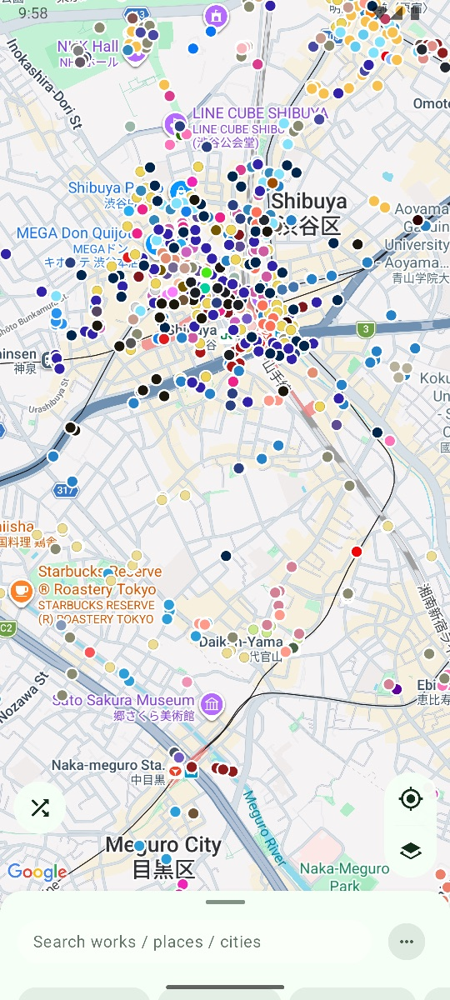
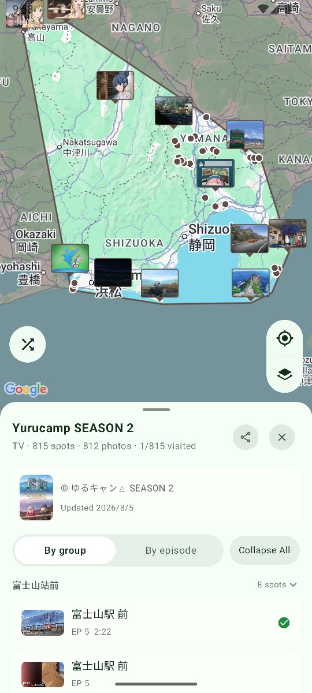
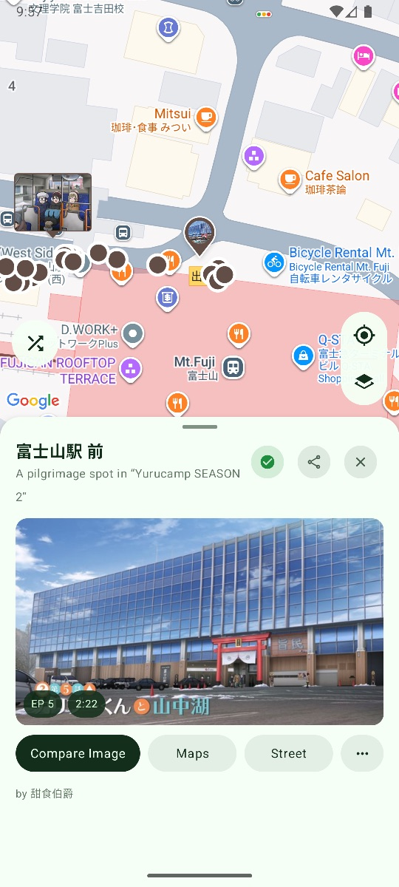
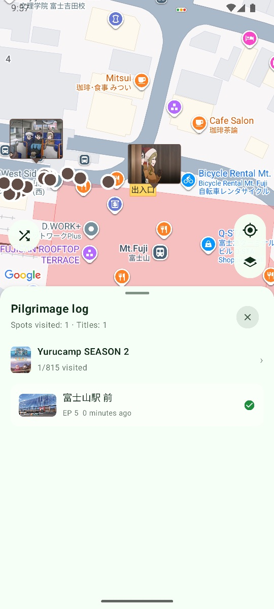

# 巡礼地图

**动画圣地巡礼的 Android 地图 —— 找到画面背后的真实地点。**

[English](README_en.md) | 中文

巡礼地图是一个基于 [anitabi.cn](https://anitabi.cn) 动画巡礼数据制作的 **Android 第三方客户端**。

地图上收录了五万多个动画取景地：你可以找到熟悉的动画场景来自现实中的哪里、对应哪一集，也可以在到达现场后打开原图，对照拍摄同样的构图。

本项目参考了开源的 [Anitabi for iOS](https://github.com/anitabi/anitabi-swift-app)。地图浏览、作品与地标卡片、搜索、对比拍摄、长按落针等主要功能与 iOS 版保持一致。

想进一步了解 Anitabi 和圣地巡礼数据，可以访问 [anitabi.cn](https://anitabi.cn)。

> **状态：已发布**
>
> 最新安装包在 [Releases](../../releases) 页面，源代码以 Apache License 2.0 开源。

## Android 版有什么不一样

在 Anitabi 原有功能之外，Android 版增加了一些更适合日常巡礼使用的功能。

* **巡礼记录**

  去过一个地标后，点一下 ✓ 就能记录完成状态。

  作品卡会显示巡礼进度，地图也可以切换为「只看已完成」或「只看未完成」。另外还有按作品整理的巡礼记录列表，方便回顾已经去过的地方。

  所有记录都保存在自己的设备上，并可以随 Android 系统备份迁移。

* **用拼音和罗马字搜索中日文名称**

  不需要切换输入法。

  例如输入拼音 `gudu yaogun`、首字母 `gdyg`，或罗马字 `yuru`，都可以搜索对应的作品。

  日文汉字与简体中文名称之间也可以互相匹配。

* **更灵活的地图卡片**

  底部信息卡可以在三种高度之间切换。想多看一点地图时，可以随手把卡片缩成一条。

  横屏使用时，卡片会自动移动到屏幕左侧，减少对地图的遮挡。

* **实验性 AI 角色抠图**

  对比拍摄时可以选择使用专门针对动画人物的分割模型，让角色抠图效果更适合二次元画面。

  此功能默认关闭，可以在「关于」页面开启，仅支持 `arm64-v8a` 设备。首次开启时会在 Wi-Fi 环境下下载模型。

  不开启时，App 会继续使用默认的通用抠图方式。

* **多语言与深浅色主题**

  支持中文、English、日本語，以及浅色 / 深色主题。

## 截图

| 地图                              | 作品                                | 地标                                 | 巡礼记录                              |
| ------------------------------- | --------------------------------- | ---------------------------------- | --------------------------------- |
|  |  |  |  |

地图底图 © Google；截图中的剧照来自 anitabi.cn 社区（CC BY-NC-SA 4.0），相关作品版权归各原权利方所有。

## 安装

**系统要求：**

* Android 10（API 29）及以上
* 设备需要支持 Google Play 服务，用于地图底图与定位

1. 前往 [Releases](../../releases) 下载最新的 `junrei-map-v*.apk`。
2. 如有需要，可以按照发布说明核对 APK 的 SHA-256。
3. 打开 APK 并按照 Android 系统提示完成安装。

如果你想自己编译 App，请查看 [开发者文档](docs/README.md)。

## 权限与隐私

巡礼地图：

* 不需要注册或登录
* 没有广告
* 不包含分析或崩溃统计 SDK
* 不收集或上传用户的巡礼记录等个人数据

App 只会在相关功能需要时使用以下权限：

| 权限     | 用途                               |
| ------ | -------------------------------- |
| 位置（粗略） | 仅在使用 App 时用于「附近的圣地」和地图跟随，不记录位置轨迹 |
| 相机     | 制作现场对比图时使用                       |
| 相册     | 保存制作完成的对比图时使用                    |

正常使用时，App 主要会连接：

* **anitabi.cn CDN**：获取巡礼数据与图片，并在设备上缓存
* **Google 地图服务**：加载地图底图

如果开启实验性的 **AI 抠图**，首次还会从 GitHub 下载一次模型文件。这意味着下载时 GitHub 会接收到正常网络连接所包含的 IP 地址。

不开启此功能，就不会产生这项模型下载请求。

## 数据与致谢

巡礼地图中的地点、作品信息和场景截图来自 [anitabi.cn](https://anitabi.cn) 社区。

如果想补充新的圣地、修正已有地点或提交其他数据，可以使用与 Anitabi 网页版 / iOS 版相同的投稿入口。App 的地标卡片和地图中都提供了对应入口。

默认情况下，App 会隐藏与限制级（R18）内容相关的地标。

对于学校、图书馆等需要特别注意礼仪的场所，App 也会显示巡礼提醒。

**请尊重当地居民、工作人员和其他访客，不进入禁止区域，不影响他人的正常生活。**

感谢 Anitabi 社区以及所有持续整理、补充和维护巡礼数据的贡献者。

## 开发者文档

如果你想了解项目的构建方法、架构设计或参与开发，请查看：

* [开发者文档](docs/README.md)
* [贡献指南](CONTRIBUTING.md)
* [安全政策](SECURITY.md)

README 主要面向普通用户，因此具体的实现方式和技术说明统一放在开发者文档中。

## 遇到问题

如果遇到问题，可以根据类型选择对应的反馈方式：

* **App 本身的问题、崩溃或功能异常**
  请在本仓库提交 [Issue](../../issues)。

* **地图数据、地点位置或作品信息错误**
  请前往 [Anitabi 文档仓库](https://github.com/anitabi/anitabi.cn-document/issues) 反馈。

## 许可

本仓库中的源代码与界面文案以 [Apache License 2.0](LICENSE) 发布。

**巡礼地图是非官方的第三方 Anitabi Android 客户端，与 Anitabi 官方不存在从属关系。**

巡礼数据与相关截图来自 anitabi.cn 社区，并依照 [CC BY-NC-SA 4.0](https://creativecommons.org/licenses/by-nc-sa/4.0/deed.zh-hans) 共享。

动画截图、作品名称及其他相关内容的版权归各自原权利方所有，在本项目中仅用于动画场景与现实地点的对照展示。

第三方组件及其许可信息请参阅：

* [NOTICE](NOTICE)
* [licenses/](licenses/)
