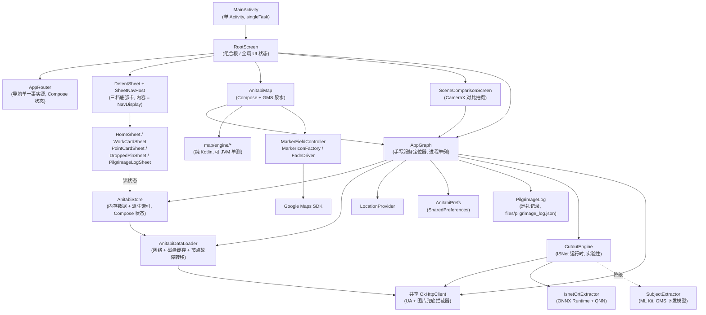

# 架构说明

本文件描述**代码当前实际的样子**,不是理想架构。凡是标注「有意为之」的取舍,请在改动前
先读对应源文件里的注释 —— 其中多数是真机验证后写下的前提条件。

标注约定:**[代码确认]** = 直接读源码得出;**[推断]** = 由代码行为合理推断;**[未知]** = 无法从
仓库确认。

## 1. 总体形态

单 Activity + Jetpack Compose 的地图应用。**没有 ViewModel、没有 DI 框架**;导航用
Navigation 3 的 back stack(`AppRouter.backStack` + `NavDisplay`),但没有 NavController /
路由图 —— 栈本身就是状态。**[代码确认]**



## 2. 组件职责

### `app/` —— 入口与全局装配

| 文件 | 职责 | 被谁调用 / 调用谁 |
|---|---|---|
| `MainActivity.kt` | 唯一 Activity。`enableEdgeToEdge()` → 解析深链 → `setContent { AnitabiTheme { RootScreen() } }`。`launchMode=singleTask`,`onNewIntent` 必须 `setIntent()` | 系统 → `AppGraph`、`MapDeepLink` |
| `AnitabiApplication.kt` | `Application` + `SingletonImageLoader.Factory`,构造 Coil `ImageLoader`(48MB 内存缓存、180ms 淡入),**复用 `AppGraph.okHttpClient`** | 系统 → `AppGraph` |
| `AppGraph.kt` | 手写服务定位器,`AppGraph.get(context)` 进程单例。持有 okHttpClient / prefs / dataLoader / store / router / locationProvider / cutoutEngine(`by lazy`)/ pendingDeepLink。内含 `SharedPrefsAnitabiPrefs` 私有实现 | UI 各处直接 `AppGraph.get(context)` |
| `AppRouter.kt` | **导航状态的唯一持有者**。`workCard` / `pointCard` / `droppedPin` / `selectedWorkIds` / `cameraSession`,以及跳转方法(`focusWork`、`selectPoint`、`closePointCard`、`backToBrowse`…) | `RootScreen` 读写;不持有相机指令 |
| `RootScreen.kt` | 组合根(约 710 行)。持有**不属于 AppRouter 的**全局 UI 状态:地图指令 `command`+`commandSeq`、`mapIdleState`、`locationActive`、`showWelcome`、`showAbout`、`imageViewerUrl`;装配 sheet / 地图 / 浮动控件 / 模态层;`BackHandler` 的优先级顺序在此 | 由 `MainActivity` 调用 |
| `ToastCenter.kt` | 顶部临时提示。`message` 与 `visible` 分离持有(避免组合期回写状态) | `AppRouter.toast` |

### `data/` —— 数据与设备能力

- **`AnitabiStore.kt`(约 710 行)**:内存中的全量数据 + 派生索引,全部是 Compose 状态。
  `bootstrap()` 在 `computeDispatcher` 上先读磁盘缓存再刷新网络;`apply()` 用
  `Snapshot.withMutableSnapshot` 原子发布,并把 `dataGeneration` 计数器**放在最后**递增
  (地图按此计数器 latch 数据集)。提供 `search()`、`groupedPoints()`、`worksInViewport()`、
  `works(tab)`、`recomputeNearby()` 等查询。**[代码确认]**
- **`data/search/`(纯 Kotlin,不 import `android.*` 也不 import `org.json`)**:
  `TextFold`(归一化管线,索引侧与查询侧唯一入口)、`SearchIndex`(索引 + 打分 + top-K)、
  `Romaji`(假名→罗马字)、`HanFoldTable` / `PinyinTable`(两张生成表,由 `tools/` 下的
  脚本从 OpenCC 与 Unihan 派生,**禁止手改**)。与 `map/engine/` 并列为第二个 JVM 可测岛
  —— 搜索的全部规则都必须能被单测直接覆盖,这也是不用 `android.icu.Transliterator`
  做汉字折叠的首要理由。**[代码确认]**
- **`AnitabiDataLoader.kt`**:HTTP + 磁盘缓存。`ORIGINS = [ww.anitabi.cn, w.junreimap.com]`
  (**有意不含主域** `anitabi.cn`,官方 API 文档明令禁止);`preferredOriginIndex` 记住上次
  成功节点;抓取 `/d/g.json` 与 `g0…g6` 分片,带与 web 端同式的 `?d=` 缓存参数。
- **`AnitabiJsonParser.kt`**:位置数组式 JSON 的容错解析(字段按下标取,缺字段返回 null 而非抛错)。
- **`LocationProvider.kt`**:FusedLocation,粗精度优先、仅前台;`startUpdates`/`stopUpdates` 由
  `RootScreen` 的生命周期观察者驱动。
- **`data/model/AnitabiModels.kt`**:领域模型 + `AnitabiImage`(路径 → CDN URL 规则、`withPlan` 换档)。
- **`data/update/`**:检查更新。`AppVersion`(可比较的版本号)与 `ReleaseInfo.parse`(GitHub Release JSON)是纯逻辑;
  `UpdateChecker` 持一份 `StateFlow`(Idle / Checking / UpToDate / Available / Failed),启动时 ≤ 每 24h 一次 `checkIfDue()`,
  关于页 `checkNow()`,两者共用。只检查、只提示:下载与安装交给浏览器,App 不申请安装权限。失败(含 GitHub 403 限流)
  不写时间戳、不清缓存,与「已是最新」严格区分。
- **`PilgrimageLog.kt` / `PilgrimageLogGroups.kt`**:用户自己的巡礼记录(本仓库自有功能,iOS 版没有)。
  与 `AnitabiStore` 分开 —— 那是只读数据集的容器,`apply()` 的快照纪律不该被用户状态搅进来;
  与 `AnitabiPrefs` 分开 —— 记录会长到几千条。落盘走 `support/AtomicWrite.kt`,`AppGraph.toggleVisited`
  把保存挂在进程级作用域上(用户已按下的动作必须做完)。

### `map/engine/` —— 纯 Kotlin 地图引擎

**这是本仓库单测覆盖最好的部分,且完全不依赖 Android/GMS**(已核实:仅 import `data.*` 与
`kotlin.math.*`)。**[代码确认]**

| 文件 | 职责 |
|---|---|
| `MapEngine.kt` | 决定「当前相机下应该画什么」。`load(dataset)`(带 version 门)、`scene(request, dotColors, minHitRadiusDp)` 一次产出**标注与圆点**。内部有 0.02° 网格索引、优先级排序。**不做增删 diff** —— 那是 `MarkerFieldController` 的事 |
| `MapScene.kt` | 一帧的全部内容(标注 + 圆点 + 作品标 + 诊断计数)。`debugLine()` 是 HUD 与真机 harness 共用的一行摘要 |
| `DotField.kt` / `DotPasses.kt` | 圆点快照。按**趟**(趟内互不重叠)再按颜色分组;命中测试也走这份快照 |
| `MarkerFootprint.kt` | 各形态相对锚点的 dp 矩形。碰撞判定与圆点遮挡共用同一份 |
| `SheetRevealPolicy.kt` | 「选中一个点之后相机要不要让位」的纯决策 |
| `MapRevealLadder.kt` | web 版显示阶梯的逐行移植(`pointThreshold`/`workThreshold`/照片档位)。另含 `MapMarkerMetrics`(尺寸随 zoom 指数插值) |
| `MarkerCollision.kt` | 屏幕空间贪心矩形排布(GMS 没有 MapKit 的碰撞系统)。矩形取自 `MarkerFootprint`。照片牌落选就直接消失(同坐标已经有圆点) |
| `MapCameraPlanner.kt` | 相机算术:`lngDelta`↔`zoom`、飞行时长、`fitBounds`(带离群点裁剪)、边距 |
| `GeoMath.kt` | **文件名与内容不一致**:里面是 `object WorkRegionGeometry`(凸包 + 外扩缓冲、点在多边形内判定)。没有叫 `GeoMath` 的类型,只有测试类沿用了这个名字 |

> **单线程契约**:`MapEngine` 的所有状态都是普通非线程安全集合,契约仅由注释声明
> (`MapEngine.kt:17`),**代码里没有任何断言或锁**。实际约束来自调用方:`AnitabiMap.kt`
> 里的 `Dispatchers.Default.limitedParallelism(1)`。**[代码确认]** 改动时必须自己守住。

### `map/google/` —— GMS 适配与渲染

> **一个场景，两个渲染器**（2026-08 改）：一帧要画什么由 `MapEngine.scene()` **一次决定** ——
> 小圆点走 `PointDotOverlay` 的**自绘叠加层**（每帧自己投影、`drawPoints` 分趟分色绘制，
> 尺寸直接取相机 zoom，因而**不设上限**、与网页版同密度，选中气球也在这层、画在圆点之上）；
> 剧照牌 / 作品标仍走 `MarkerFieldController` 的 Marker 链（≤121 个）。
>
> **一个点在一帧里只有一种形态**，这条不变式由 `MapScene` 的构造过程保证（`MapSceneTest` 钉住）。
> 此前两者由两条互不知情的 `snapshotFlow` 各自决定、靠跨对象打听「哪些点已经有 Marker」来避让，
> 真机上表现为「点了之后气球出现、圆点却还在」「气球被邻近的圆点盖住」。
>
> 中间短暂用过 `TileOverlay`，但光栅瓦片只在**整数 zoom** 换图、带内一律拉伸 `2^f`，
> 给出的是「地理尺寸恒定」而网页版要「屏幕尺寸恒定」——
> 圆点因此在带内胀 2 倍、跨带瞬缩 1.9 倍，且永远在放大位图。这条路走不通，已弃。
>
> **层序的取舍**：自绘层画在**所有 Marker 之上**，所以「压住」只能靠不画来表达 ——
> `MapEngine.scene` 把落在标注足迹（`MarkerFootprint`，外扩一个圆点白描边的半径）里的圆点
> 整点剔除。网页版是圆点画在下面被挡住，差别只在标注边缘一圈，观感上看不出来。
>
> **重叠处的白描边**：圆点先按 `DotPasses` 分**趟**，趟内任意两点圆心距 ≥ `2r+stroke`。
> 于是「趟内先白后彩、趟间按序覆盖」与逐点 painter's order **逐像素相同**
> （`DotRenderFidelityTest` 在真机/模拟器上逐像素比对过），
> 而绘制调用数仍是 `Σ(1 + 每趟颜色数)`。不分趟的话后画的填充会吃掉前一个圆点的白环
> —— 挨近的两个点之间那道白就没了。
>
> 分趟的槽位规则是「**已放置冲突邻居的最小槽位 − 1**」（`DotPasses.assign`）——
> 不是「最高空趟」。空趟贪心不保证重叠对按 priority 排序，而冲突图随 zoom 连续变，
> 逆序对会在缩放中来回翻（真机反馈「上下关系闪」）。min−1 规则下任何重叠对的
> 上下关系＝priority 全序，与 zoom 无关。
>
> 趟数封顶 32。**分不开的点不画**（`DotField.hiddenCount`），不是并进已占的趟 ——
> 并进去就等于让它们互相吃白环，正是要消灭的症状。被藏的点不进冲突网格，
> 下降链在断点处自愈。东京 z13 实测约 31% 的点落到这里，全埋在深堆叠里；
> 顶层（最孤立）的点照画，密集斑块的观感不变。hidden 的点也**不可点中**。
>
> 分趟用的间距还乘了 `DotPasses.ZOOM_LAG_MARGIN`：分趟算在 tick 的 zoom 上、绘制用当前相机的 zoom，
> 缩小的那一两帧里两者最多差一个 tick（≈65ms）。1.2 的实测容忍度是 Δz≈0.55。
>
> **选中气球也在叠加层里**（画在圆点之上，层序与网页版一致），不是 GMS Marker。
> 曾是 Marker：位图 44×54dp 的命中框 + 外扩足迹扫除，让选中点周围 ~49×59dp 的圆点
> 全部不画、不可点，tap 一律折回已选中的点 ——「选中后再点旁边的点没反应」就是这片锁定区。
> 挪进叠加层后邻点照画照点，命中按气球实际形状（头圆 r16dp@锚上 26dp + 尾 10×12dp）。
> 代价：气球不再有 Marker 的 220ms 淡入，即时出现。
>
> **点击命中**（`MapSceneHitTest`，对**已发布的场景**判定 —— 所见即可点）：
>
> | 目标 | 可点范围 |
> |---|---|
> | 气球（选中点） | 头圆 r16dp + 尾 10×12dp，视觉最顶层 ⇒ 最优先 |
> | 圆点 | 绘制圆盘 r+stroke（z13≈7.5dp、z16≈8.3dp 半径）内取**趟号最高**（tap 像素的归属，不是圆心最近）；盘外 22dp 热区内取最近。22dp ⇒ 44dp 目标，对齐 Android 48dp 指南（600dpi 手指误差 ±3mm≈±19dp） |
> | 剧照牌 | GMS marker 位图框（先行短路）＋外扩足迹兜底（死区对策） |
>
> 必须同时挂在 `setOnPoiClickListener` 上 —— 巡礼点常压在车站 POI 图标上。

- **`AnitabiMap.kt`(约 700 行)**:Compose 层。**不持有导航状态**,只画图并向上回调。
  参数含 `command: MapCommand?`(相机指令)与 `obstruction: () -> MapObstruction`
  (**有意是 lambda**,为了延迟读取避免每帧重组;**同时带当前值与目标值** ——
  避让判定要的是「卡片最终会遮住多少」,靠 debounce 猜弹簧沉降会在动画起步前就到期)。
  主更新循环是一个 `MapEffect(Unit)` 内的 `snapshotFlow{SceneKey(...)}.sample(48)`。
- **`MarkerFieldController.kt`**:帧集合 → 实际 marker 的增删 diff。新增有
  **3ms/帧预算**(`ADD_BUDGET_NANOS`)并由 `Choreographer` 摊销。
- **`MarkerFadeDriver.kt` + `FadeCurve.kt`**:淡入淡出,独立的 2.5ms 预算与量化步进
  (`FadeCurve.kt` 虽在 `google/` 包下但零平台依赖)。
- **`MarkerIconFactory.kt`**:所有 marker 位图的 Canvas 自绘(GMS marker 不能放 View)。
  多级 LruCache(dot 512 条 / photo 24MB / balloon 32 条 / work 8MB)。
- **`MarkerImageCache.kt`**:marker 缩略图抓取。24MB 字节界 LruCache、RGB_565 解码、
  独立的 OkHttp Dispatcher(避免动到主 client);并发上限 4 由 `Semaphore` 保证 ——
  OkHttp 的 `maxRequests*` 只对异步 `enqueue()` 生效,而这里走同步 `execute()`。
- **`BangumiIconSprite.kt`**:作品图标雪碧图(60×60 单元、每行 20 个),按需裁剪单元并缓存;
  磁盘缓存键只取 `?v=` 版本号、**有意不含 host**(切节点不失效)。
- **`WorkRegionOverlayRenderer.kt`**:作品模式的压暗层。因 GMS 对「带洞的全球环」镶嵌会崩,
  拆成 5 个多边形拼出来。

### `ui/` —— Compose 界面

- **`ui/sheet/SheetNav.kt` / `SheetNavHost.kt`**:sheet 的内容栈。`SheetKey`
  (`Home / Work / Point / DroppedPin / PilgrimageLog`)是 Navigation 3 的 `NavKey`;`SheetNavHost` 把
  `AppRouter.backStack` 交给 `NavDisplay`,只组合栈顶一层,被压住的层的状态
  (搜索文字、滚动位置)由 `rememberSaveableStateHolderNavEntryDecorator` 保存。
  `SheetPeek` 是每层各档(`Detent.Mini / Medium / Expanded`)露出高的**静态**表
  (`visibleDp`,有单测);`SheetHandle` 是矮把手。
- **`ui/sheet/DetentSheet.kt`**:竖屏宿主,Google Maps 式三档底部卡 = Foundation 的
  `AnchoredDraggableState` + 一个把列表滚动接到 sheet 上的 `NestedScrollConnection`(移植自 M3)。
  锚点在布局相位由容器高 + `SheetPeek` 换算(只在锚点集变化时才读 `targetValue`/`offset`),
  放置时才读 offset(拖拽只重放置,不重测、不重组);吸附/甩动交给 `AnchoredDraggableDefaults.flingBehavior`,
  **列表带动的甩动也在 `anchoredDrag {}` 里结算**(否则 `currentValue` 不跟档位走);把手带无障碍展开/收起动作;
  Home 只有 Medium/Expanded,卡片层三档,层切换一律落到「落档」(`SheetPeek.restDetent`)。
  横屏是**同一个** sheet 收窄到 360dp 停靠左侧(避开状态栏/刘海),卡片只留 Mini/Expanded 两档
  (容器矮,半开只够露半张封面);地图让位跟着档位走 —— 展开时挡整列(左 padding),收成一条时只挡
  底部那条身份条(下 padding),拖拽中插值。固定整列 padding 不行:真机实测 GMS 会剔除深入 padding 区的
  Marker,收起的 sheet 上方那一列就成了落针 / 剧照牌的死区。
  历史:自绘 `SheetHost`(实测高度 → 重设锚点的反馈环)→ M3 `BottomSheetScaffold` 两档
  → 借 M3 Hidden 手势伪造第三档(与 M3 手势管线互相踩脚)→ 现在这版。教训只有一条:
  **锚点必须静态,手势管线必须自持**。
- **`ui/home/HomeSheet.kt`(约 850 行)**:搜索 + 附近 + 作品浏览三态。搜索经
  `produceState(Dispatchers.Default)` 异步执行,定位不进 key(否则后台定位更新会重排结果)。
- **`ui/work/WorkCardSheet.kt` / `ui/point/PointCardSheet.kt` / `ui/point/DroppedPinSheet.kt`**:三张卡片。
- **`ui/log/PilgrimageLogSheet.kt`**:巡礼记录列表(已完成地标按作品聚类,分组是 `data/PilgrimageLogGroups.kt` 的纯函数)。
- **`ui/image/ImageViewer.kt`**:内联全屏查看器(非 Dialog),手势缩放/平移,保存与分享。
- **`ui/scene/SceneComparisonScreen.kt`(约 890 行,全库最大)**:CameraX 对比拍摄 + 结果页。
- **`ui/scene/cutout/`**:**名为 ui 实为服务层** —— 运行时下载原生库、`System.load`、ONNX 推理。
  见下文技术债。
- **`ui/components/`**:地图控件柱、图标、系统栏样式。
- **`theme/`**:自绘调色板 `AnitabiPalette`(浅/深两套 26 个 token)经
  `LocalAnitabiPalette` 下发。**有意不用 `MaterialTheme.colorScheme`**。同处还提供 `LocalNameLocale`
  (作品名 / 地标名跟随界面语言:中文名 / 原题 / 英文题名,由 `data/model/NameLocale` 的纯 Kotlin 规则决定,
  store 与 engine 以参数接收它,不碰 Android `Locale`)。

### `support/` —— 无状态工具

`Deeplink.kt`(深链解析 + `ALLOWED_HOSTS` 白名单)、`AnitabiWebLink.kt`(外链 URL 构造)、
`CustomTabs.kt`(`ExternalLinks`:CCT 固定浏览器包 / 交给 App 打开两条路径)、
`ImageHostFallback.kt`(图片 host+尺寸兜底拦截器)、`CanvasDraw.kt`(共享的 `drawAspectFill`)。

## 3. 主流程:启动 → UI → 交互

```
Process start
  → AnitabiApplication.newImageLoader()          构造 Coil(复用共享 OkHttpClient)
  → MainActivity.onCreate()
      enableEdgeToEdge()
      handleDeepLink(intent, allowPersistedFallback = true)
          MapDeepLink.parse(uri) → AppGraph.pendingDeepLink
          无 intent 数据时才回放 prefs.restoredDeepLink
      setContent { AnitabiTheme { RootScreen() } }
  → RootScreen 组合
      AppGraph.get(context)                      首次构造整张图(主线程)
      LaunchedEffect { store.bootstrap() }        computeDispatcher:先磁盘缓存→再网络刷新
          AnitabiDataLoader.loadFromCache() / refresh()
          AnitabiStore.apply()                    Snapshot 原子发布,末尾 dataGeneration++
      DetentSheet(SheetNavHost) + AnitabiMap + 浮动控件 + 模态层
  → AnitabiMap 的 MapEffect(Unit) 启动更新循环
      snapshotFlow{SceneKey}.sample(48)
        → engine.load(MapDataset.from(store, generation))   仅当 generation 变化
        → withContext(engineDispatcher) { engine.frame(...) ; controller.plan(...) }
        → controller.apply(...)                              marker 增删(3ms/帧预算)
```

用户交互(以点选地标为例):

```
点击 marker
  → MarkerFieldController.onPointTap(id)
  → AnitabiMap 的回调 onPointTap
  → RootScreen: store.point(id) → router.selectPoint(point)
  → AppRouter.backStack 压入 SheetKey.Point(pointCard 是它的投影)
  → NavDisplay 淡入 PointCardSheet;LaunchedEffect(topKey) 把 sheet 收到该层的初始档
  → 同时 RootScreen 递增 commandSeq 并下发 MapCommand.FlyToPoint
  → AnitabiMap 的 LaunchedEffect(command?.seq) 执行相机动画
```

## 4. 数据流

```
网络/磁盘                内存                      UI
─────────               ─────                    ────
AnitabiDataLoader  →  AnitabiStore(Compose 状态) →  各 Composable 直接读
  /d/g.json             points / bangumis            (无 ViewModel、无 Repository 中间层)
  /d/g0…g6.json         + 派生索引
  /d/users.csv          + dataGeneration ────────→  AnitabiMap 按 generation latch 数据集
  /d/bangumi-icons.json
```

**关键点:UI 直接读 `AnitabiStore` 的 Compose 状态,没有 Repository/UseCase 层。** 这是有意的
架构选择,不是遗漏。**[代码确认]**

## 5. 状态管理

| 状态 | 属主 | 观察方式 |
|---|---|---|
| 导航(卡片栈、过滤、相机会话) | `AppRouter`(`mutableStateOf`) | UI 直接读属性 |
| 全量数据与派生索引 | `AnitabiStore`(`mutableStateOf`) | UI 直接读属性 |
| 地图相机指令 | `RootScreen` 的 `command` + `commandSeq` | `AnitabiMap` 的 `LaunchedEffect(command?.seq)` 去重消费 |
| sheet 档位 | `AnchoredDraggableState<Detent>`(`RootScreen` 里 `remember`) | `RootScreen` 通过 `requireOffset()` / `anchors.positionOf(targetValue)` 延迟读取,换算成 `MapObstruction` |
| sheet 显示哪一层 | `AppRouter.backStack`(内部 `mutableStateListOf`,对外只读 `List`) | `SheetNavHost` 的 `NavDisplay` |
| 抠图运行时 | `CutoutEngine.state`(`StateFlow`) | `collectAsStateWithLifecycle` |
| 持久化偏好 | `AnitabiPrefs`(SharedPreferences) | 读进 `remember` 后写回 |
| 巡礼记录(已完成地标) | `PilgrimageLog`(`mutableStateOf` 的不可变 Map + `generation` 计数) | UI 直接读;地图只把 `generation` 放进 `SceneKey`,真正的集合经 `rememberUpdatedState` 在 worker 里读 |
| 定位 | `LocationProvider`(`mutableStateOf`) | UI 直接读 |

由 `points`/`bangumis` 派生的全部索引(`bangumiById`、`searchIndex`、`pointsByBangumi` 等)
收在一个不可变的 `AnitabiStore.Indexes` 里,与数据**在同一次 snapshot 提交中发布**。
这是硬约束而非风格问题:普通字段的写入不参与 snapshot,会先于它索引的数据可见。**[代码确认]**

**没有把整棵 UI 状态树交给 `rememberSaveable`,也没有 `SavedStateHandle`**(模态开关与图片查看器是例外)。 旋转靠
`configChanges="orientation|screenSize|screenLayout|keyboardHidden|uiMode|fontScale|density"`
避免重建。进程死亡后**卡片栈与相机位是恢复的** —— `RootScreen` 在 `ON_STOP` 把
`focusedWorkId`/`selectedPointId`/相机位/`bids` 写进 `prefs.restoredDeepLink`,
`MainActivity` 冷启动时回放(见 §3)。丢失的是已拍照片,以及未持久化的模态开关。**[代码确认]**

## 6. 持久化

| 载体 | 位置 | 内容 |
|---|---|---|
| SharedPreferences | 名为 `"anitabi"` | 数据基线时间戳、最近访问、底图样式、剧照图层开关、巡礼记录过滤模式、持久化深链、引导完成、ISNet 实验开关、检查更新(`update.*`:开关、上次成功时间、最新 tag/URL 缓存、忽略的 tag) |
| 内部存储 | `filesDir/pilgrimage_log.json` | **巡礼记录**(用户标为「已完成」的地标:id / bangumiId / 时间戳)。owner 是 `data/PilgrimageLog.kt`(Compose 状态 + 原子写),进系统备份;损坏时改名为 `.corrupt-*` 保留 |
| 磁盘缓存 | `cacheDir/anitabi-data/` | `g.json`、`g0…g6.json`、`bangumi-icons.json`、雪碧图 `.img` |
| 内部存储 | `filesDir/cutout/` | 抠图运行时:`libonnxruntime.so`、QNN 库、ONNX 模型、`manifest.json`(24h TTL) |
| MediaStore | `Pictures/Anitabi` | 用户保存的截图与对比图(JPEG q=92,写入期间 `IS_PENDING=1`) |

**迁移策略:没有。** 没有数据库,SharedPreferences 键直接读写,缓存文件损坏时靠解析失败
回退到网络。改键名会静默丢失用户设置。**[代码确认]**

备份:`fullBackupContent`/`dataExtractionRules` 只包含 sharedpref 与 `pilgrimage_log.json`,数据缓存与 cutout 运行时被隐式排除。

## 7. 网络

**全 App 只有一个 `OkHttpClient`**(`AppGraph.okHttpClient`),数据加载、Coil、marker 缩略图、
雪碧图、抠图下载全部复用它。上面挂了两个拦截器:

1. **UA 拦截器**:`AnitabiMap-Android/<versionName> (Android <SDK_INT>)`。依据是官方文档仓库
   issue #86(正确配置 UA + 人类频率很难触发超限)。
2. **`ImageHostFallbackInterceptor`**:仅作用于图片 host。失败时按 ①原样 → ②换另一个 host
   → ③换另一档尺寸(h160⇄h360)重试,最多 3 次;触发条件是 IOException / 5xx / 404。
   完整尺寸(无 `plan`)**不参与降档**;**404 只做到 ②**(同路径换尺寸对不存在的对象必然
   同样失败)。兜底在 Coil 之下改写 URL,响应仍以最初的 URL 为键入缓存,故是一次性成本。

   两个 host:主 host `image-anitabi.magiconch.com` 跟随 web 客户端对本 App 所用 origin
   (`ww.anitabi.cn` / `w.junreimap.com`)的解析结果,五个命名空间实测可用但**未被开放 API
   文档收录**;兜底 host `image.anitabi.cn` 是文档指定地址,只收录 `points/` 与 `bangumi/`。

请求流:

```
UI/Coil → OkHttpClient(UA → 图片兜底) → CDN
                                          ↑
AnitabiDataLoader 另有自己的 ORIGINS 故障转移(ww → junreimap),
拦截器有意不插手数据 host,避免双重重试。
```

- **认证:无。** 应用不登录、无 token、无用户身份。**[代码确认]**
- **超时**:数据加载 `callTimeout(15s)`;marker 图片 `callTimeout(20s)`;client 默认其余。
- **错误处理**:数据层失败 → `DataLoadPhase.Failed` → HomeSheet 显示重试;图片失败 →
  拦截器兜底 + `ImageViewer` 自动重试 2 次后给可点重试的失败态。
- **抠图下载**:断点续传(`Range`)、大小校验、SHA-256 校验、`renameTo`、`setReadOnly()`、
  写 `.ok` 标记;仅在非计费网络下载;release 强制 https(debug 可 cleartext 以便 `adb reverse`)。

## 8. 依赖方向

```
ui/*  ──────→ app/AppGraph ──→ data/*  ──→ 共享 OkHttpClient
  │                └────────→ ui/scene/cutout/*(实为服务层)
  ├──────→ app/AppRouter(状态)
  ├──────→ support/*(无状态工具)
  └──────→ theme/*

map/google/* ──→ map/engine/*(纯 Kotlin,单向)
map/google/* ──→ data/AnitabiStore(只读)+ AppGraph.okHttpClient
```

**允许**:UI → AppGraph → data;map/google → map/engine。
**禁止**(当前也确实没有):data/ 或 map/engine/ 反向依赖 UI;map/engine 依赖 Android/GMS。

## 9. 架构约束(改动时请保留)

1. **`map/engine/` 必须保持纯 Kotlin**,不得引入 `android.*` / `androidx.*` / `com.google.*`。
   它是单测的主要对象,一旦污染就无法在 JVM 上测。
   1b. **用户状态(巡礼记录)不走 `MapDataset`/`version`**:那会在每次打卡时重建 50k 点的索引。
   它以 `MapEngineRequest.visitFilter/visitedPointIds` 逐帧传入,`SceneKey` 只带 `visitedGeneration`。
2. **`MapEngine` 的单线程契约**:所有调用必须在同一个 `limitedParallelism(1)` dispatcher 上。
3. **`dataGeneration` 必须在数据写完之后才递增**(`AnitabiStore.apply()` 末尾),否则地图会
   latch 到撕裂的数据集。
4. **协程里捕获宽异常必须先重抛 `CancellationException`** —— 仓库里已因此产生过两次真实 bug。
5. **Compose 高频值用延迟读取**(provider lambda / `graphicsLayer`),不要在组合期读。
6. **sheet 的栈只通过 `AppRouter` 的方法改**;`NavDisplay` 只读它。层的尺寸只改 `SheetPeek`。
7. **三个 locale 的字符串键集必须一致**;手写串只放 `strings_app.xml`。
8. **不请求主域 `anitabi.cn`**(官方 API 文档明令),图片遵守 `plan` 档位纪律;
   图片 host 跟随 web 客户端对本 App 所用 origin 的解析规则,改动前先读 `AnitabiImage` 的 KDoc。
9. **APK 不打包 `libonnxruntime.so`**(`androidComponents` 里排除),抠图原生库一律运行时下载校验。

## 10. 已确认的架构债

按影响排序,均为**确认存在**,不是猜测。**这里只记录问题,不是重构清单**。

1. **`ui/scene/cutout/` 名不副实**:它做的是网络下载、SHA-256 校验、`System.load`、ONNX 推理,
   属于服务层而非 UI。位置误导新贡献者。
2. ~~两处重复的 MediaStore 保存实现~~ **已解决**:统一到 `support/MediaStoreSaver.kt`
   (触发原因是"保存不能随组合被取消"这个修复必须做两遍)。
3. **~~屏幕空间碰撞逻辑写了两遍~~（已收敛:`MarkerCollision` 只剩剧照之间的碰撞）原先**:`MapEngine.declutter`(作品种子)与 `MarkerCollision.resolve`
   (地标),投影公式相同、实现独立。
4. **淡入淡出逻辑成对复制**:`MarkerFieldController` 的 `fadeInPoint`/`fadeInWork` 与
   `fadeOutPoint`/`fadeOutWork` 除类型外逐字相同。
5. **两套并行的图标 key 方案**:`MarkerFieldController.describe()` 生成的 `iconKey` 与
   `MarkerIconFactory.keyFor()` 各建各的键,**必须手工保持同步**,否则缓存会错配。
6. **超大 composable 文件**:`SceneComparisonScreen` ≈890 行、`HomeSheet` ≈850 行、
   `RootScreen` ≈710 行、`AnitabiMap` ≈700 行,单文件承担多职责。
7. **确认的死代码(部分已清)**:已删 `AppRouter.closeWorkCard()/clearWorkFilter()`、
   `AnitabiStore.nearestBeyondNeighborhood`、`MapCameraPlanner.MAX_FIT_ZOOM`、
   `MapDataset.EMPTY`、`AnitabiWebLink.myMapsViewer()`。
   仍在的:`MarkerIconFactory` 的 3 个旧 API(`photo/balloon/work`)、
   `MarkerFieldController.clear()`(连带 `MarkerFadeDriver.cancelAll()`)、
   `MarkerFadeDriver.inFlight`、`MapWorkSeed.hasIcon`(写了从不读)。
8. ~~`MapRevealLadder.displayPriority()` 的 KDoc 与实现不符~~ **已解决**:该函数已随圆点层重写移除。
9. ~~构建脚本的日文注释与失效引用~~ **已解决**:构建文件与 manifest 已统一中文,
   「計画 §…」引用已删除。
10. **`GeoMath.kt` 文件名与内容不符**(内容是 `WorkRegionGeometry`)。
11. **进程死亡后仍会丢已拍照片**:卡片栈与相机位由 `prefs.restoredDeepLink` 恢复,
    模态开关与图片查看器已改用 `rememberSaveable`;只剩照片没有恢复 ——
    需要持久化 bitmap,成本与收益不成比例,有意接受。
12. ~~`lintDebug` 失败~~ **已解决**:0 error,并已配 `abortOnError = true` + CI 门禁。
    剩余 warning 以 `UseKtx`/`AutoboxingStateCreation` 等提示为主(`strings_anitabi.xml`
    的未用串已随文案独立重写一并删除)。
13. **文字对比度低于 WCAG AA**(`inkSecondary` 3.97:1 / `inkTertiary` 2.6 / `inkFaint` 2.2),
    移植自 iOS 设计,**有意未改**,作为设计取舍保留。
